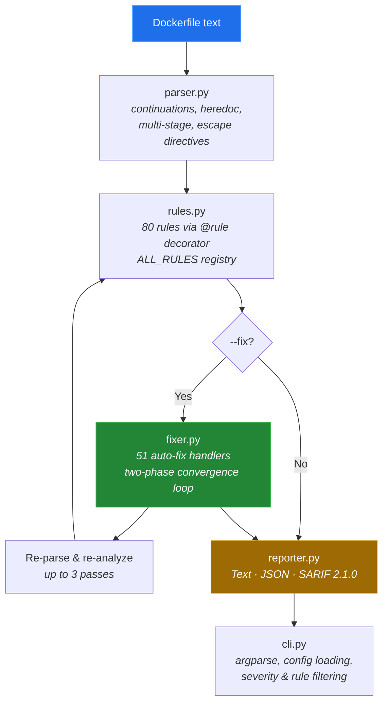

# Dockerfile Doctor

[](https://github.com/crabsatellite/dockerfile-doctor/actions/workflows/ci.yml)
[](https://pypi.org/project/dockerfile-doctor/)
[](https://pypi.org/project/dockerfile-doctor/)
[](LICENSE)

The only Dockerfile linter that fixes what it finds. 80 rules, 51 auto-fixers, pure Python, zero dependencies.

```
$ dockerfile-doctor Dockerfile
Dockerfile: ./Dockerfile
  File     [WARNING]  DD008  No USER instruction - running as root
  Line 1   [WARNING]  DD001  Using 'latest' tag on base image
  Line 3   [ERROR]    DD002  apt-get update not combined with install
  Line 5   [WARNING]  DD003  Missing --no-install-recommends  (fixable)
  Line 5   [WARNING]  DD004  Missing apt cache cleanup  (fixable)
  Line 8   [WARNING]  DD009  pip install without --no-cache-dir  (fixable)
  Line 12  [WARNING]  DD019  Shell form used for CMD  (fixable)

  Found 7 issues (1 error, 5 warnings, 1 info)
  4 auto-fixable issues (use --fix to apply)
```

## Why this exists

Every Dockerfile linter tells you what's wrong. None of them fix it for you.

Dockerfile Doctor is a **lint-and-fix** tool: run `dockerfile-doctor --fix` and 51 rules are applied automatically — cache cleanup, security hardening, exec-form conversion, layer consolidation, and more. No manual edits, no copy-pasting from Stack Overflow.

- **51 deterministic auto-fixers** that rewrite your Dockerfile correctly.
- **80 rules** covering security, performance, correctness, and maintainability.
- **Pure Python, zero dependencies.** `pip install` and go. ~100KB installed.
- **Programmatic API.** Parse, analyze, and fix Dockerfiles in your own tools.
- **SARIF 2.1.0 output.** Plugs into GitHub Code Scanning directly.
- **1,400+ tests, 99% coverage.**

## When to use what

[Hadolint](https://github.com/hadolint/hadolint) is the gold standard for Dockerfile linting -- battle-tested, 12K+ stars, and deeply integrated with ShellCheck for catching shell scripting issues inside `RUN` instructions. If you need the deepest possible analysis, Hadolint is hard to beat.

**Dockerfile Doctor fills a different niche:** automatic fixing. Hadolint tells you what's wrong; this tool rewrites it for you. They work well together.

|                   | Dockerfile Doctor       | Hadolint                |
| ----------------- | ----------------------- | ----------------------- |
| **Focus**         | Lint + auto-fix         | Lint + shell analysis   |
| **Auto-fix**      | 51 rules                | Not available           |
| **Shell linting** | Dockerfile-level        | ShellCheck (~200 rules) |
| **Install**       | `pip install`           | Binary / Docker         |
| **Language**      | Python (importable API) | Haskell                 |

## Installation

```bash
pip install dockerfile-doctor
```

Or from source:

```bash
git clone https://github.com/crabsatellite/dockerfile-doctor.git
cd dockerfile-doctor
pip install -e .
```

## Usage

```bash
# Lint a Dockerfile
dockerfile-doctor Dockerfile

# Auto-fix issues
dockerfile-doctor --fix Dockerfile

# Scan a directory
dockerfile-doctor ./services/

# JSON output
dockerfile-doctor --format json Dockerfile

# SARIF 2.1.0 (GitHub Code Scanning)
dockerfile-doctor --format sarif Dockerfile > results.sarif

# Filter by severity
dockerfile-doctor --severity warning Dockerfile

# Ignore specific rules
dockerfile-doctor --ignore DD012,DD015 Dockerfile
```

## Rules

80 rules across security, performance, and maintainability. 51 are auto-fixable.

### Security (12 rules)

| ID    | Rule                                    | Sev  | Fix |
| ----- | --------------------------------------- | ---- | :-: |
| DD008 | No USER instruction - running as root   | WARN | Yes |
| DD020 | Secrets in ENV/ARG                      | ERR  |     |
| DD050 | `chmod 777` gives excessive permissions | WARN | Yes |
| DD052 | SSH key or `.git` directory in COPY/ADD | ERR  |     |
| DD053 | `.env` file copied into image           | ERR  |     |
| DD054 | Piping remote script to shell           | WARN |     |
| DD055 | `wget` with `--no-check-certificate`    | WARN | Yes |
| DD056 | `curl` with `-k`/`--insecure`           | WARN | Yes |
| DD057 | `git clone` with embedded credentials   | ERR  |     |
| DD058 | Hardcoded credentials in RUN            | ERR  |     |
| DD060 | `--privileged` flag in RUN              | WARN |     |
| DD069 | `apt-get install` with wildcard         | WARN |     |

### Performance & Image Size (24 rules)

| ID    | Rule                                                | Sev  | Fix |
| ----- | --------------------------------------------------- | ---- | :-: |
| DD002 | `apt-get update` not combined with `install`        | ERR  |     |
| DD003 | Missing `--no-install-recommends`                   | WARN | Yes |
| DD004 | Missing apt cache cleanup                           | WARN | Yes |
| DD005 | Multiple consecutive RUN instructions (layer bloat) | INFO | Yes |
| DD006 | `COPY . .` before dependency install (cache bust)   | WARN |     |
| DD007 | `ADD` used instead of `COPY`                        | WARN | Yes |
| DD009 | `pip install` without `--no-cache-dir`              | WARN | Yes |
| DD010 | `npm install` instead of `npm ci`                   | INFO | Yes |
| DD013 | `apt-get upgrade` in Dockerfile                     | WARN | Yes |
| DD016 | `curl`/`wget` without cleanup                       | INFO |     |
| DD018 | Large base image (slim/alpine available)            | INFO |     |
| DD025 | `apk add` without `--no-cache`                      | WARN | Yes |
| DD026 | `apk upgrade` in Dockerfile                         | WARN | Yes |
| DD031 | `yum install` without `yum clean all`               | WARN | Yes |
| DD033 | `dnf install` without `dnf clean all`               | WARN | Yes |
| DD034 | `zypper install` without `zypper clean`             | WARN | Yes |
| DD059 | `ADD` with remote URL                               | INFO | Yes |
| DD061 | `gem install` without `--no-document`               | INFO | Yes |
| DD062 | `go build` without `CGO_ENABLED=0`                  | INFO | Yes |
| DD063 | `apk add` dev packages without `--virtual`          | INFO |     |
| DD064 | Too many RUN layers                                 | INFO |     |
| DD065 | Duplicate RUN instruction                           | WARN | Yes |
| DD066 | Multi-stage build without `COPY --from`             | INFO |     |
| DD070 | Copying entire build context                        | INFO |     |

### Correctness (12 rules)

| ID    | Rule                                   | Sev  | Fix |
| ----- | -------------------------------------- | ---- | :-: |
| DD023 | Missing `-y` in `apt-get install`      | ERR  | Yes |
| DD036 | Multiple CMD instructions              | WARN | Yes |
| DD037 | Multiple ENTRYPOINT instructions       | WARN | Yes |
| DD038 | Invalid EXPOSE port                    | ERR  |     |
| DD039 | `COPY --from` references unknown stage | ERR  |     |
| DD043 | SHELL instruction not in exec form     | ERR  | Yes |
| DD047 | Empty RUN instruction                  | ERR  | Yes |
| DD049 | Multiple HEALTHCHECK instructions      | WARN | Yes |
| DD079 | Invalid STOPSIGNAL value               | ERR  | Yes |
| DD080 | VOLUME with invalid JSON syntax        | ERR  | Yes |
| DD040 | Pipe without `set -o pipefail`         | WARN | Yes |
| DD044 | Duplicate ENV key                      | INFO | Yes |

### Maintainability & Best Practices (32 rules)

| ID    | Rule                                       | Sev  | Fix |
| ----- | ------------------------------------------ | ---- | :-: |
| DD001 | No tag or `latest` on base image           | WARN |     |
| DD011 | `WORKDIR` with relative path               | WARN | Yes |
| DD012 | No `HEALTHCHECK` instruction               | INFO |     |
| DD014 | Exposing insecure ports (21, 23)           | INFO |     |
| DD015 | Missing Python env vars (PYTHONUNBUFFERED) | INFO | Yes |
| DD017 | Deprecated `MAINTAINER` instruction        | WARN | Yes |
| DD019 | Shell form CMD/ENTRYPOINT                  | WARN | Yes |
| DD021 | `sudo` in RUN                              | WARN | Yes |
| DD022 | Pin versions in `apt-get install`          | INFO |     |
| DD024 | Use `apt-get` instead of `apt`             | WARN | Yes |
| DD027 | Pin versions in `apk add`                  | INFO |     |
| DD028 | Pin versions in `pip install`              | INFO |     |
| DD029 | Pin versions in `npm install`              | INFO |     |
| DD030 | Pin versions in `gem install`              | INFO |     |
| DD032 | Pin versions in `yum install`              | INFO |     |
| DD035 | Missing `DEBIAN_FRONTEND=noninteractive`   | INFO | Yes |
| DD041 | COPY/ADD to relative path without WORKDIR  | WARN | Yes |
| DD042 | `ONBUILD` instruction found                | INFO |     |
| DD045 | `RUN cd` instead of `WORKDIR`              | INFO | Yes |
| DD046 | No LABEL instructions                      | INFO | Yes |
| DD048 | Duplicate EXPOSE                           | INFO | Yes |
| DD050 | Stage name should be lowercase             | INFO | Yes |
| DD067 | Missing `NODE_ENV=production`              | INFO | Yes |
| DD068 | Java without container-aware JVM flags     | INFO | Yes |
| DD071 | Instruction not uppercase                  | INFO | Yes |
| DD072 | TODO/FIXME comment found                   | INFO | Yes |
| DD073 | Missing final newline                      | INFO | Yes |
| DD074 | Very long RUN line (>200 chars)            | INFO |     |
| DD075 | Trailing whitespace                        | INFO | Yes |
| DD076 | Empty continuation line                    | INFO | Yes |
| DD077 | Deprecated or EOL base image               | WARN | Yes |
| DD078 | Missing version LABEL                      | INFO | Yes |

## Architecture



Key design decisions:

- **Zero dependencies**: stdlib only (optional PyYAML for config, fallback parser included)
- **Two-phase fixer**: multi-line fixes (DD005 RUN combining) run first and claim line ranges; single-line fixes skip consumed lines, preventing corruption
- **Convergence loop**: fixer runs up to 3 passes (parse → fix → re-parse) so fixes that consume lines don't block other fixes
- **SARIF 2.1.0**: enables GitHub Code Scanning integration out of the box

## Configuration

```yaml
# .dockerfile-doctor.yaml
severity: warning

ignore:
  - DD012
  - DD015

rules:
  DD001:
    severity: error
```

## CI Integration

### GitHub Actions

```yaml
- name: Lint Dockerfiles
  run: |
    pip install dockerfile-doctor
    dockerfile-doctor --format sarif Dockerfile > dockerfile-doctor.sarif

- name: Upload SARIF
  uses: github/codeql-action/upload-sarif@v3
  with:
    sarif_file: dockerfile-doctor.sarif
```

### Pre-commit

```yaml
repos:
  - repo: https://github.com/crabsatellite/dockerfile-doctor
    rev: v0.1.0
    hooks:
      - id: dockerfile-doctor
        args: [--severity, warning]
```

## Programmatic API

```python
from dockerfile_doctor.parser import parse
from dockerfile_doctor.rules import analyze
from dockerfile_doctor.fixer import fix

dockerfile = parse(open("Dockerfile").read())
issues = analyze(dockerfile)
fixed_content, applied = fix(dockerfile, issues)
```

## Development

```bash
pip install -e ".[dev]"
pytest  # 1400+ tests, 99% coverage
```

## License

Apache 2.0
