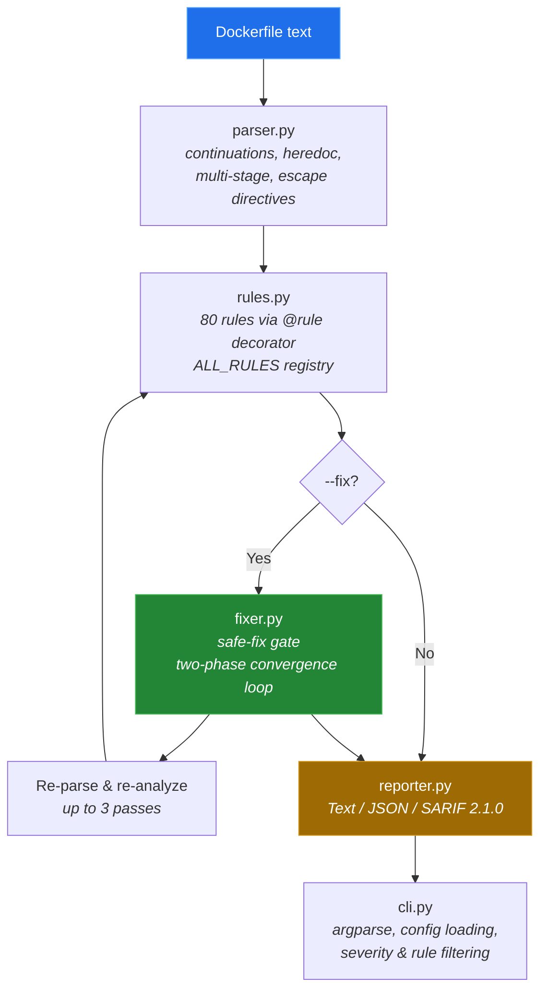

# Dockerfile Doctor

[](https://github.com/crabsatellite/dockerfile-doctor/actions/workflows/ci.yml)
[](https://pypi.org/project/dockerfile-doctor/)
[](https://pypi.org/project/dockerfile-doctor/)
[](LICENSE)

Safe Dockerfile auto-fixes for CI and PR bots. Dockerfile Doctor is a zero-dependency Python codemod that applies small, deterministic Dockerfile fixes and leaves complex judgment to humans or AI agents.

```console
$ dockerfile-doctor Dockerfile
Dockerfile: ./Dockerfile
  File     [WARNING]  DD008  No USER instruction - running as root  (review)
  Line 1   [WARNING]  DD001  Using 'latest' tag on base image
  Line 3   [ERROR]    DD002  apt-get update not combined with install
  Line 5   [WARNING]  DD003  Missing --no-install-recommends  (review)
  Line 5   [WARNING]  DD004  Missing apt cache cleanup  (fixable)
  Line 8   [WARNING]  DD009  pip install without --no-cache-dir  (fixable)
  Line 12  [WARNING]  DD019  Shell form used for CMD  (fixable)

  Found 7 issues (1 error, 5 warnings, 1 info)
  3 safe auto-fixable issues (use --fix to apply)
  2 review-only suggestions
```

## Why This Exists

Good AI agents are better than a static tool at understanding unusual Dockerfiles. Dockerfile Doctor is not trying to replace that judgment.

It is for the boring part: obvious, repeatable edits that should not require a person or an LLM every time. Run `dockerfile-doctor --fix` and it applies only safe mechanical changes such as apt/apk/yum cache cleanup, `ADD` to `COPY`, exec-form command conversion, trailing whitespace cleanup, duplicate instruction cleanup, and final newline fixes. Risky or semantic changes are reported for review instead of being rewritten by the CLI.

- **80 checks** covering security, performance, correctness, and maintainability.
- **41 safe auto-fixes** exposed through `--fix`.
- **Pure Python, zero dependencies.** `pip install` and go.
- **Programmatic API** for agent workflows, internal CI, and batch PR automation.
- **Text, JSON, and SARIF 2.1.0 output** for terminals, scripts, and GitHub Code Scanning.
- **1,400+ tests** covering parser, rules, reporter output, fixers, and idempotency.

## Ecosystem Position

Dockerfile Doctor is a codemod layer, not a replacement for the broader Docker tooling ecosystem.

| Tool | Use it for | Dockerfile Doctor's role |
| ---- | ---------- | ------------------------ |
| Docker Build Checks | Official BuildKit validation and syntax-aware checks | Run alongside it; Doctor handles small source edits. |
| Hadolint | Deep Dockerfile linting and ShellCheck-backed `RUN` analysis | Use Hadolint for findings; Doctor for safe rewrites. |
| Trivy / Checkov / Dockle | Security, compliance, and image/IaC scanning | Keep those as gates; Doctor is not a scanner replacement. |
| tally | Broad modern Dockerfile/Containerfile linting and formatting | Doctor stays smaller: Python, zero dependencies, safe codemod/API focus. |
| AI agents | Complex Dockerfile refactors and project-specific tradeoffs | Let AI review unresolved findings after Doctor has removed noise. |

The intended workflow is:

1. Run Dockerfile Doctor first to remove obvious low-risk issues.
2. Run Docker Build Checks, Hadolint, and security scanners for broader coverage.
3. Send the remaining review-only findings to a human or AI agent.

## Installation

```bash
pip install dockerfile-doctor
```

Or from source:

```bash
git clone https://github.com/crabsatellite/dockerfile-doctor.git
cd dockerfile-doctor
pip install -e .
```

## Usage

```bash
# Lint a Dockerfile
dockerfile-doctor Dockerfile

# Apply only safe mechanical fixes
dockerfile-doctor --fix Dockerfile

# Scan a directory for Dockerfile, Dockerfile.*, and *.dockerfile
dockerfile-doctor ./services/

# JSON output
dockerfile-doctor --format json Dockerfile

# SARIF 2.1.0 for GitHub Code Scanning
dockerfile-doctor --format sarif Dockerfile > results.sarif

# Filter by severity
dockerfile-doctor --severity warning Dockerfile

# Ignore specific rules
dockerfile-doctor --ignore DD012,DD015 Dockerfile

# Score Dockerfile quality
dockerfile-doctor --score Dockerfile

# Report only issues on changed lines
dockerfile-doctor --diff HEAD Dockerfile
```

## Fix Policy

The CLI intentionally has no high-risk fix mode. Findings are split into three practical buckets:

| Bucket | CLI behavior | Examples |
| ------ | ------------ | -------- |
| Safe fix | Applied by `--fix` | Cache cleanup, `ADD` to `COPY`, exec-form `CMD`, duplicate `EXPOSE`, trailing whitespace. |
| Review-only | Reported, not rewritten | Adding `USER`, adding `--no-install-recommends`, combining `RUN`, changing `NODE_ENV`, adding metadata labels. |
| Advisory | Reported only | Secrets, unknown stages, base image pinning, missing `.dockerignore`, architectural advice. |

This keeps automated PRs small, reviewable, and easy to revert.

## Compatibility Plan

Older releases exposed `--unsafe-fixes` and `fix(..., unsafe=True)`. Those
entry points are now deprecated compatibility shims:

| Release window | Legacy behavior |
| -------------- | --------------- |
| `0.1.6` | `--unsafe-fixes` is accepted but hidden from help; it prints a warning and runs the same safe-only behavior as `--fix`. `unsafe=True` emits `DeprecationWarning` and also runs safe-only fixes. |
| `0.2.x` | Keep the same fallback while downstream CI and API callers migrate. |
| `0.3.0` or `1.0.0` | Remove the legacy CLI flag and Python keyword after at least one minor release of warning-only compatibility. |

Review-only fixes will not be re-enabled through a public batch switch. They
should be handled by a human, an AI agent, or targeted project-specific code.

## Rule Coverage

80 rules across security, performance, correctness, and maintainability.

### Safe Fixes Exposed By `--fix`

`DD004`, `DD007`, `DD009`, `DD011`, `DD013`, `DD017`, `DD019`, `DD021`, `DD023`, `DD024`, `DD025`, `DD026`, `DD031`, `DD033`, `DD034`, `DD036`, `DD037`, `DD040`, `DD041`, `DD043`, `DD044`, `DD045`, `DD047`, `DD048`, `DD049`, `DD050`, `DD051`, `DD055`, `DD056`, `DD059`, `DD061`, `DD062`, `DD065`, `DD068`, `DD071`, `DD073`, `DD075`, `DD076`, `DD077`, `DD079`, `DD080`.

### Review-Only Suggestions

`DD003`, `DD005`, `DD008`, `DD010`, `DD015`, `DD035`, `DD046`, `DD067`, `DD072`, `DD078`.

### Advisory / Non-Fix Rules

`DD001`, `DD002`, `DD006`, `DD012`, `DD014`, `DD016`, `DD018`, `DD020`, `DD022`, `DD027`, `DD028`, `DD029`, `DD030`, `DD032`, `DD038`, `DD039`, `DD042`, `DD052`, `DD053`, `DD054`, `DD057`, `DD058`, `DD060`, `DD063`, `DD064`, `DD066`, `DD069`, `DD070`, `DD074`.

## Architecture


```mermaid
flowchart TD
    A["Dockerfile text"] --> B["parser.py<br/><i>continuations, heredoc,<br/>multi-stage, escape directives</i>"]
    B --> C["rules.py<br/><i>80 rules via @rule decorator<br/>ALL_RULES registry</i>"]
    C --> D{"--fix?"}
    D -- Yes --> E["fixer.py<br/><i>safe-fix gate<br/>two-phase convergence loop</i>"]
    E --> F["Re-parse & re-analyze<br/><i>up to 3 passes</i>"]
    F --> C
    D -- No --> G["reporter.py<br/><i>Text / JSON / SARIF 2.1.0</i>"]
    E --> G
    G --> H["cli.py<br/><i>argparse, config loading,<br/>severity & rule filtering</i>"]

    style A fill:#1f6feb,stroke:#58a6ff,color:#fff
    style E fill:#238636,stroke:#3fb950,color:#fff
    style G fill:#9e6a03,stroke:#d29922,color:#fff
```

Key design decisions:

- **Zero dependencies**: stdlib only, with optional PyYAML for config and a fallback parser included.
- **Safe-fix gate**: CLI `--fix` applies only review-free mechanical edits.
- **Two-phase fixer**: multi-line fixes claim line ranges before single-line fixes run, preventing corruption.
- **Convergence loop**: fixer runs up to 3 passes (`parse -> fix -> re-parse`) so fixes that consume lines do not block later safe fixes.
- **SARIF 2.1.0**: enables GitHub Code Scanning integration out of the box.

## Configuration

```yaml
# .dockerfile-doctor.yaml
severity: warning

ignore:
  - DD012
  - DD015

rules:
  DD001:
    severity: error
```

## CI Integration

### GitHub Actions

```yaml
- name: Lint Dockerfiles
  run: |
    pip install dockerfile-doctor
    dockerfile-doctor --format sarif Dockerfile > dockerfile-doctor.sarif

- name: Upload SARIF
  uses: github/codeql-action/upload-sarif@v3
  with:
    sarif_file: dockerfile-doctor.sarif
```

### Pre-commit

```yaml
repos:
  - repo: https://github.com/crabsatellite/dockerfile-doctor
    rev: v0.1.6
    hooks:
      - id: dockerfile-doctor
        args: [--severity, warning]
```

## Programmatic API

```python
from dockerfile_doctor.parser import parse
from dockerfile_doctor.rules import analyze
from dockerfile_doctor.fixer import fix

dockerfile = parse(open("Dockerfile", encoding="utf-8").read())
issues = analyze(dockerfile)
fixed_content, applied = fix(dockerfile, issues)
```

## Development

```bash
pip install -e ".[dev]"
pytest
```

## License

Apache 2.0
